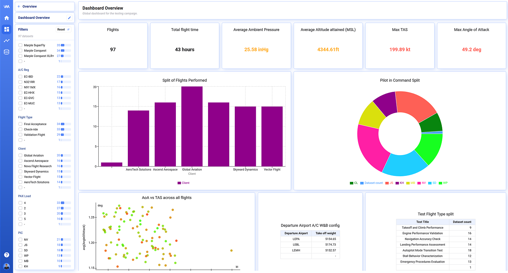
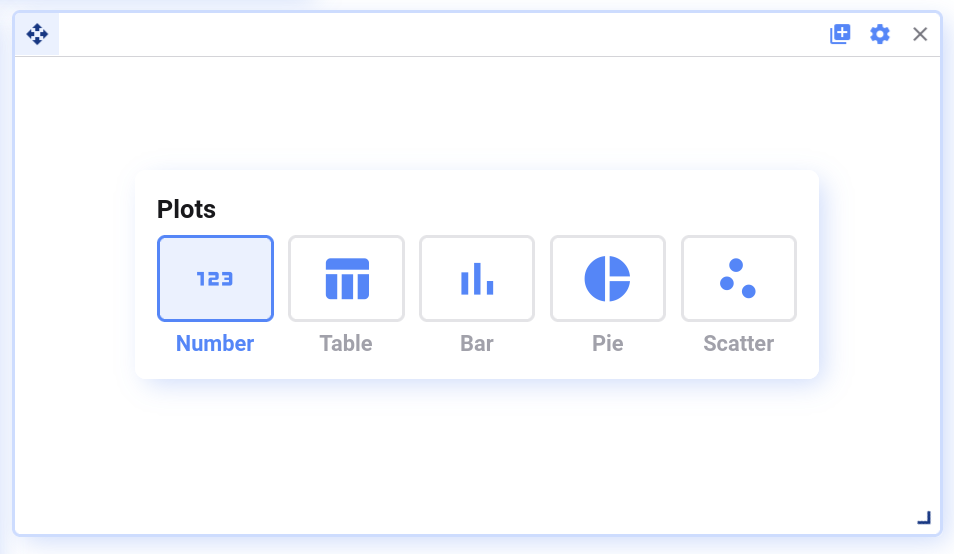
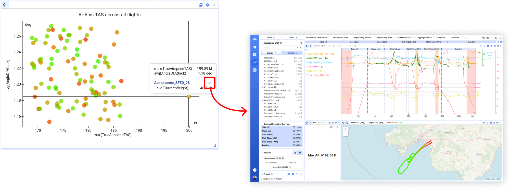
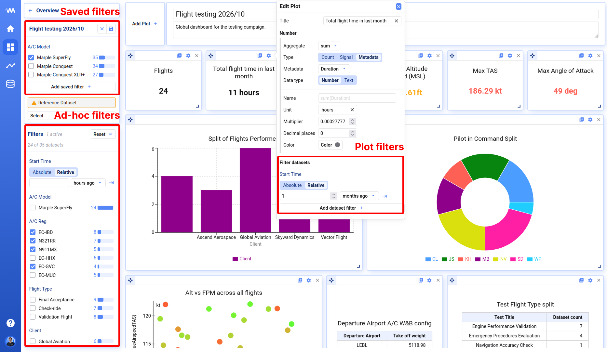
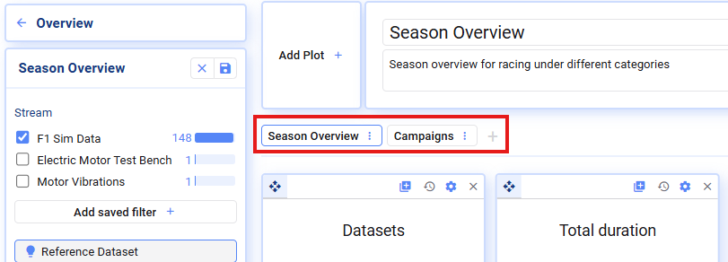

Overview dashboards are in active development — we welcome your suggestions and feedback.

Overview dashboards are one of Deepview's most powerful features, letting you interact with all your data sets in a single view. For example, you can build a dashboard to track the progress of a test campaign:

## Plot types

Currently, the following plot types are supported:

- **Number plots** — show one aggregated value across all data sets, e.g. total runtime [h]
- **Table, Pie, and Bar plots** — show multiple aggregate values grouped by a second value, e.g. average motor temperature for low, medium, and high load cases
- **Scatter plots** — show two aggregates as a single dot per data set, e.g. maximum vibration vs. maximum temperature for every data set

Scatter plots can be used to identify outliers — click the visualize icon to open a data set for deeper analysis.

You can build your plots based on:

- Raw signal values from your data sets, e.g. `speed`, `temperature`
- Math channels derived from raw signals, e.g. `temperature_fahrenheit` — see [Functions](/deepview/analysis/functions)
- Data set metadata, e.g. `operator`, `location`

## Filtering

Overview dashboards let you filter the data sets you want to see, on three levels:

1. **Saved filters** — make a primary selection of which data sets should appear on the dashboard
2. **Ad-hoc filters** — useful to quickly dive into a subset of the data; reset whenever you open the dashboard from scratch
3. **Plot filters** — apply extra filtering at the plot level; also saved as part of the dashboard definition

## Tabs

Divide your plots across multiple tabs for a better overview.

In edit mode, you can add, delete, rename, and duplicate tabs.

{/* UNMATCHED extra screenshot found on live page, no marker to replace */}

