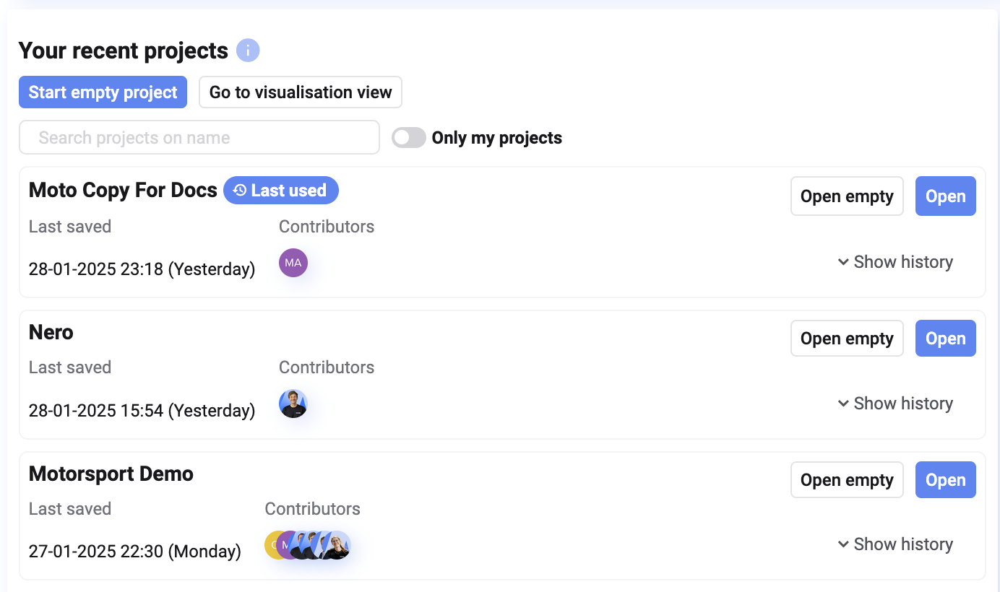
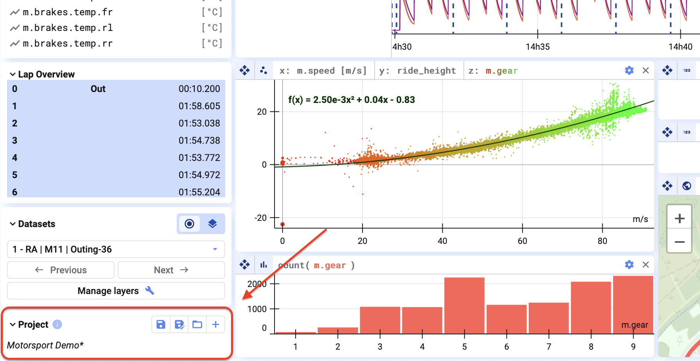
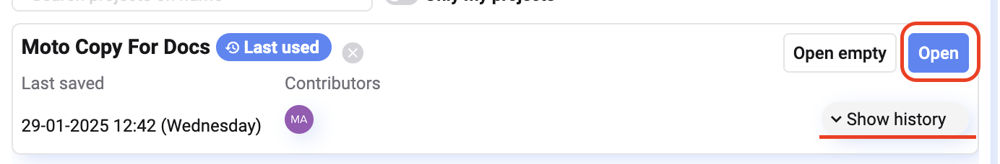
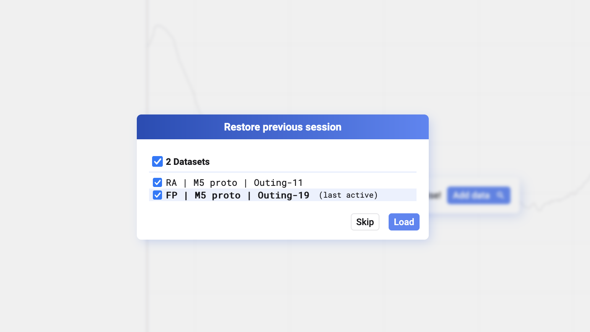
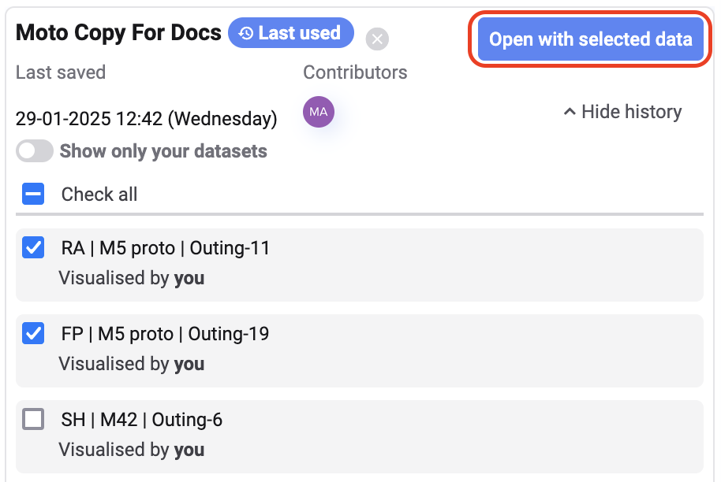
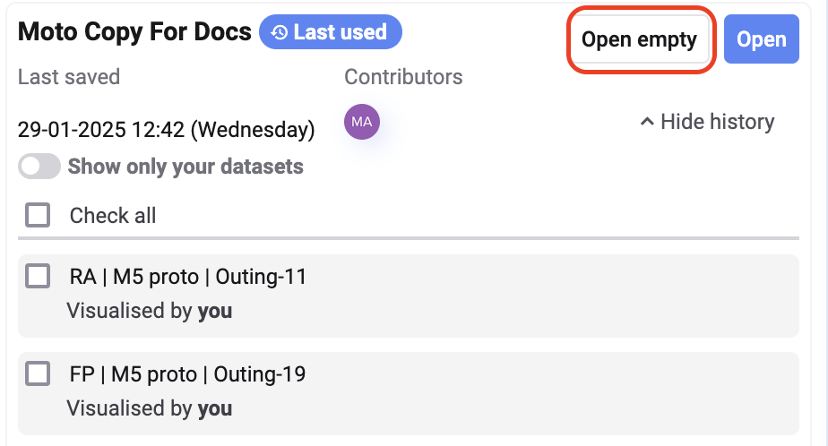
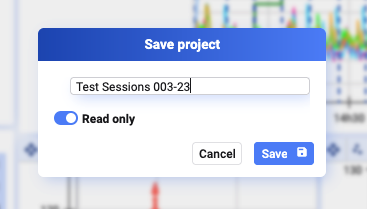

## Overview

Projects in Deepview let you save plot layouts, tabs, and other visualization configuration for easy access in future sessions. You can also share projects with your team.

You'll find an overview of all projects your team has been working on on the Deepview home page. For each project, you'll also see:

- Last saved date and time
- Contributors to the project
- Data sets linked to the project
- Whether the project is [read-only](#read-only)

In the visualization view, at the bottom-left of your window, you'll find information about the project you're working on.

## Load data sets into projects

To open a project, click **Open** next to it in the recent projects list on the home page.

Before the project loads, you're prompted to select which data from your last session you want to reload.

You can also reload previously loaded data by clicking **Show History** and selecting the data sets you want to include in the project.

If you'd like to open a project empty, click **Open empty** in the recent projects list.

## When to use projects

Use projects when analyzing multiple data sets from the same source or logger.

A project saves your plot layouts, selected signals, signal order, and even calculated signals. Once set up, you can instantly apply the same analysis to new data sets — Deepview automatically carries over your calculations for seamless data exploration.

## Read-only

By default, projects in Deepview are editable by everyone in your workspace, making collaboration seamless.

If you want to restrict edits, you can set a project to **read-only**. Only you can then modify and save changes, while others can view but not edit — any changes made by others won't be saved.

To enable read-only mode, toggle the **Read-Only** option when saving a new project.

