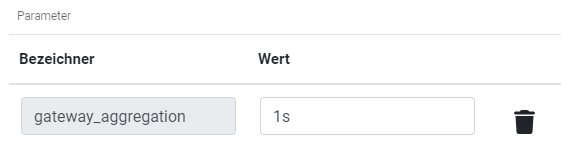
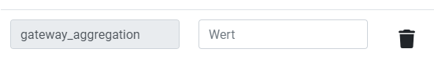

:::danger
ℹ This feature is available with the optional AWS Gateway Module. Please get in touch with us.
:::

# At-a-glance

To enable an Edge to connect to AWS IoT Core, the device must be registered in AWS and configured with a certificate. The certificate can be used by the gateway endpoint to authenticate itself.

The following guide describes the steps required to set up an Edge as an IoT device.

# Creating a device (Thing) in IoT Core

1. Log in to the AWS Console Portal and switch to AWS IoT Core
2. Under "Manage" → "Things", create a new device
   - ⚠ The Thing name must match the "Hostname" of the Edge
   - Select a "Thing Type"
3. Create a "Device certificate"
   - Keep the certificate files safe!!!!
   - **Important**: Assign policies

# Setting up and converting the certificate

Both the certificate and the associated policy can be changed afterwards. Note that the certificate cannot be downloaded again, but a new one can be created.

The certificate files downloaded from AWS are not in the required format for the endpoint. A ".pfx" file is required. This is created from the private key (`...-private.pem.key`), the certificate (`...-certificate.pem.crt`), and the AWS root certificate (`AmazonRootCA1.pem`).

### Linux

1. Open the WSL environment
2. Navigate to the directory containing the downloaded certificate files
3. Use the following command:

```
openssl pkcs12 -export -in certificate.pem.crt -inkey private.pem.key -out THINGNAME\_certificate.pfx -certfile AmazonRootCA1.pem
```

4. You will be prompted for an "export" password. This must currently be a specific predefined password, as the endpoint has been configured with it to open the certificate
   - The password can be requested from AK or RM
   - Alternatively, there may be entries in the Edge Keepass where the password is specified.

### Windows

On Windows, the "CertUtil" tool can be used in PowerShell.

1. The certificate and private key file must have the same name with the respective file extensions "crt" and "key"
2. In the shell:

```
certutil -mergepfx \<certificate-name>.crt \<result-name>.pfx
```

3. You will be prompted for a password. This must currently be a predefined one expected by the Edge endpoint. (Password must be requested from customer support.)

:::note
ℹ It is recommended to store all files, the password used during conversion, and the hostname in a safe location.
:::

# Setting up the Gateway Endpoint

1. Navigate in the Edge UI to: "System > Settings" → Gateway → desired endpoint
2. Under "Login credentials": upload the certificate file and save

# Adding measured variables

## Manual

1. Navigate to the desired dispatcher: "Forwarding" → "Endpoint" → "desired dispatcher" (e.g. Dispatcher NuP)
2. Click the "+" button at the bottom
3. Select the desired measured variable(s).
4. Enter the initial settings, such as the aggregation interval (this setting can be changed at any time)
5. Save

Additional measured variables can be added.

## Automated retrieval available from version 2.14

### 1. Marking measured variables

To automatically retrieve measured variables, the measured variable intended for transmission must be given a parameter. To do this, go to the list of measured variables for a device and open the editing dialog for the respective measured variable. Here you add an additional parameter with the identifier gateway\_aggregation.



**Aggregation interval**

The aggregation interval is specified as a string literal and follows this schema:

- s = seconds
- m = minutes
- h = hours

A value could therefore look like this, for example:

- 15s
- 1m
- 2h

**Transmitting raw values**

If the measurement point is to be transmitted raw (not aggregated), the value "0" ("null", without time literals) must be specified for the parameter.

:::caution
Due to a bug, parameters can no longer be completely deleted from a measured variable. To prevent the measured variable from being selected for the gateway, the value for the entry can be left **EMPTY**.
:::



### 2. Retrieving in the gateway

To trigger automated retrieval, click the "Retrieve measured variables" button in the respective dispatcher.


After a brief moment, the previously marked measured variables will be configured in the dispatcher with the respective aggregation.

:::note
Automated import is only possible as long as no measured variables are currently added to the gateway. Manual changes will therefore not be overwritten. If measured variables have already been added, they must be removed from the gateway. With the new bulk editing functions, this can be done in just a few clicks.
:::
