# Preparation

- Determine the IP address of the field device
- Determine the device type of the field device (e.g. Modbus, Simatic S7)
- Connect the field device to the Edge's network

---
# General workflow

1. Make the field device available in the Edge's network

2. Determine the IP address and type of the field device

3. Add a new device

4. Import variables or *configure them manually*

5. Visualize data

---
# Adding a device

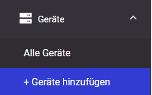

- Go to "+ Add devices" in the main menu
- Select the appropriate device type

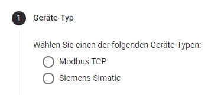

- Enter the required information (may vary depending on device type)

1. Network address of the field device

2. Identifier (required later when setting up the visualization; **can only be changed from version 2.7 onwards**)

3. Additional device-specific entries

4. Optional: select a template

- You can provide additional information in the form of "tags" (key-value pairs)

- This information is only used to store additional metadata
- The information is displayed later on the device page, but has no further use within the Edge system.

---
# Setting up measured variables

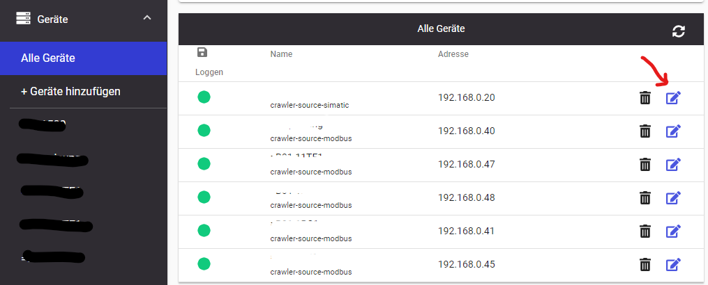

## Import (only for "S7 symbolic addressing")

:::note
ℹ Importing measured variables and their structure from the field device is currently only supported for S7 controllers with symbolic addressing.
:::

:::caution
⚠ For large PLC structures, the import may fail. We are currently working on an optimization. As an alternative, use the CSV import or manual configuration.
:::

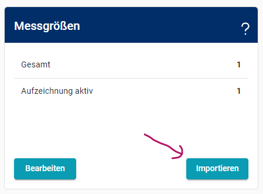

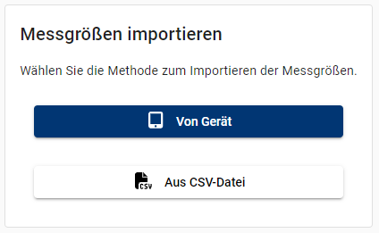

- Prerequisite: a connection to the field device has been established
  - This is shown on the device page, or displayed as a notification when it changes

- Pressing "From device" retrieves the structure and measured variables from the field device
- The "Variable Browser" then displays the available measured variables and their surrounding structure
  - Already imported measured variables are highlighted in ***grey***
  - Measured variables that are configured on the Edge but were not found on the field device during import are highlighted in ***yellow***
- Select all desired measured variables that you want to add for data recording
- Then go to the "Cart" → "Import all"

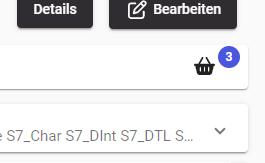

- Set the desired configuration for this import

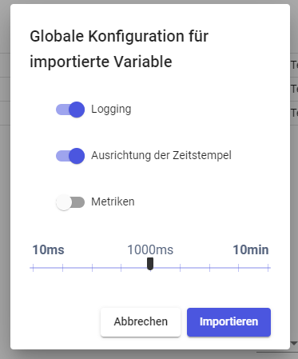

## Manual configuration of measured variables

- Navigate to "Edit" under "Measured variables" on the device page
- In the "Variable Browser" you can create new groups and measured variables

New group:

New measurement point:

### **Creating groups**

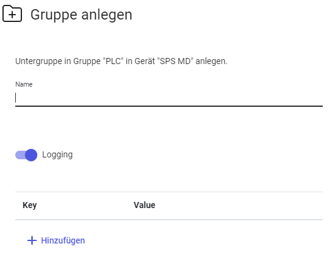

- Identifier for the group (has no effect on the later address of the measured variable and serves for organization purposes)
- Should subordinate measured variables be recorded (**recommended = Yes;** this setting cannot be changed)
- Optional: metadata (currently not in use)

### Creating a measured variable

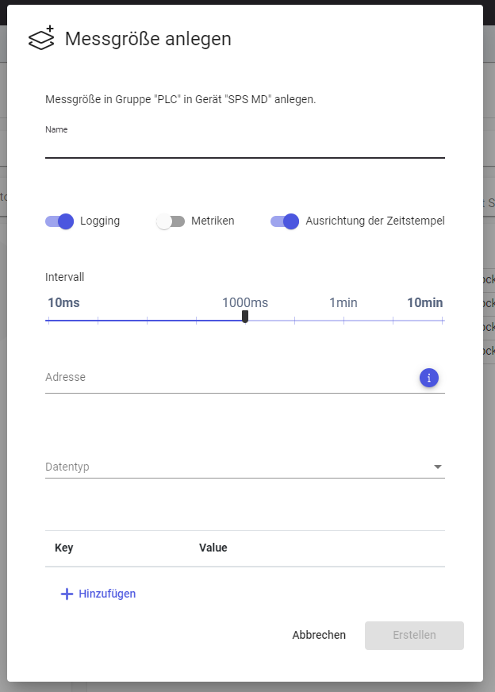

- Name = identifier of the measured variable, used for later selection in Grafana (can be changed later)
- Logging = should recording be started immediately after creating this measured variable
- Interval = sampling rate
- Address = address on the PLC (follow the schema: Specification: Protocols and Field Devices | Manual address entry (!!!LINK))
- Data type = select from supported data types
- Optional: metadata (currently not in use in the system)

---
# Modifying configured measured variables

:::note
**Planned content:**

- What can be edited and how.
- Editing individually and in bulk
- Deleting (individually, in bulk, and groups)
- Expert mode (via JSON)
:::

## Which settings can be changed for a measured variable?

- Name
  - NOTE: Changes to the name require adjustments in already configured dashboards
  - The name should be unique within a group level; otherwise incorrect values may be displayed in the visualization
- Sampling rate
  - Data range: 10ms to 500 h
  - Specified in milliseconds
- Start and stop recording
- Enable/disable timestamp alignment
- Enable/disable recording metrics
- Add/remove tags

## Editing or deleting a single measured variable

- Identify / search for measured variables
- Edit in place
  - Name and sampling rate (ms)

Dialog via icon:

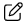

1. Sampling rate

2. Start and stop recording

3. Enable/disable timestamp alignment

4. Enable/disable recording metrics

5. Add/remove tags

6. Delete (confirmation required)

   - NOTE: Measured variables can no longer be retrieved in the visualization. Already configured panels may display incorrect or no data.

   - Currently, recorded data is not deleted and used disk space is therefore not freed.

## Editing or deleting multiple measured variables in bulk

- Select the desired measured variables in the Variable Browser (add to the "Shopping Cart")
  - Selection is **highlighted in color**
  - The number of selected measured variables is shown on the Shopping Cart
    - top right:

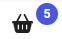

- Open the Shopping Cart

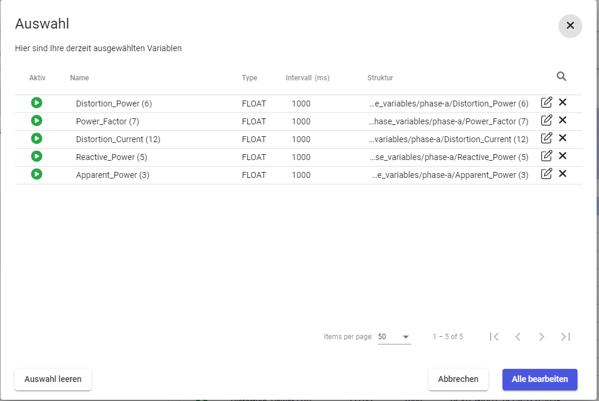

- Adjust the selection if needed ("x" only removes the measured variable from the Shopping Cart; it is not deleted)
- "Edit all"

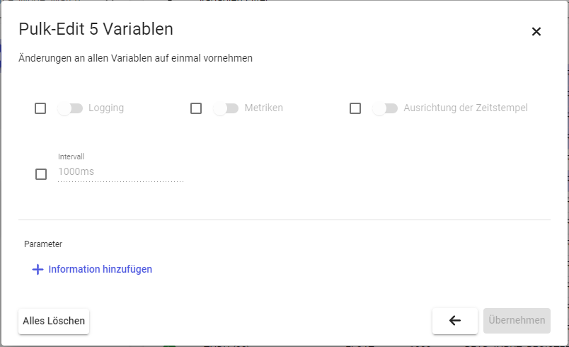

- Overwrite individual settings for all measured variables
- If the current settings differ across the current selection, this is indicated

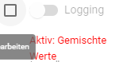

- By checking the checkbox, an individual setting can be overwritten
  - The setting can be applied to all selected measured variables using "Apply"
- After applying, you are returned to the Shopping Cart. It can now be closed or further edits can be made.
