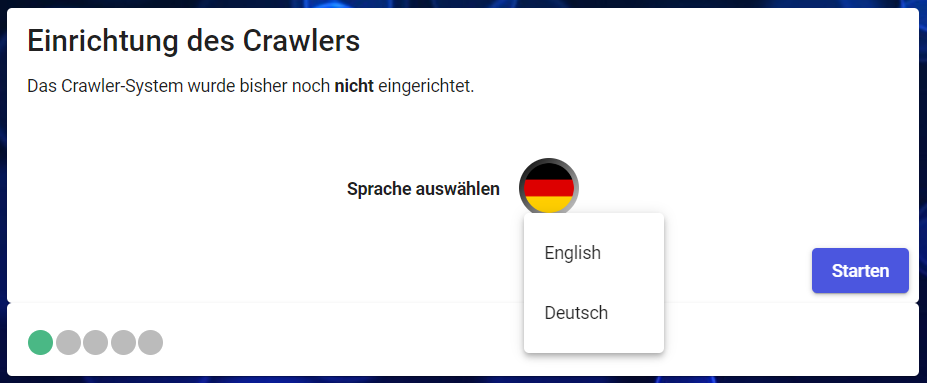
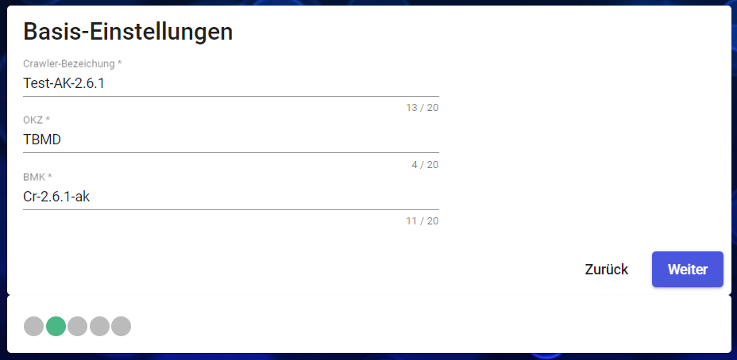
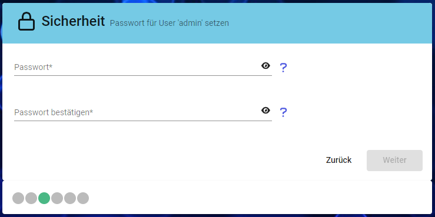
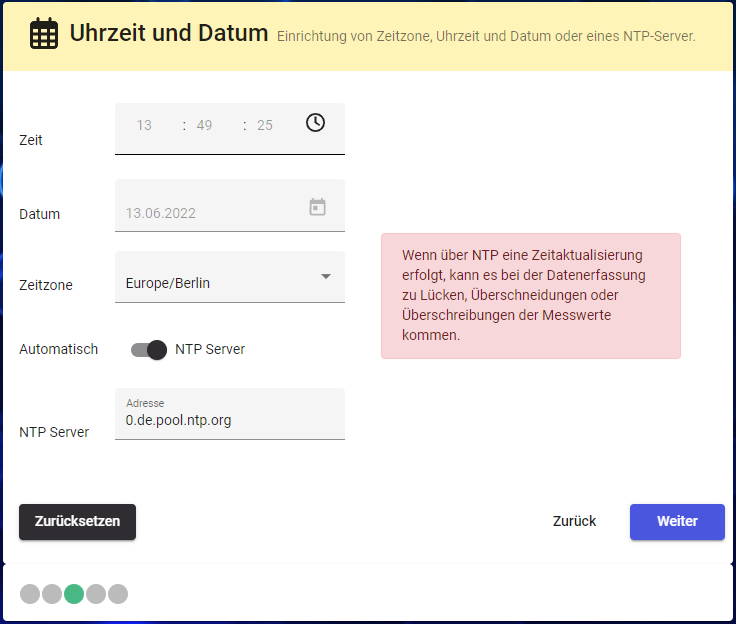
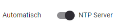
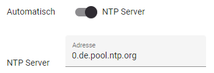
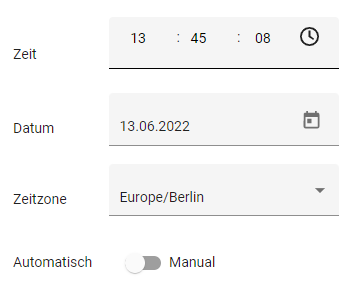
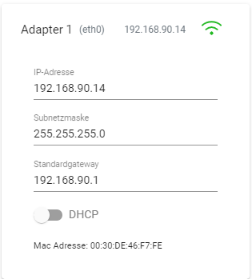
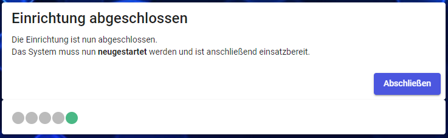

This guide contains information for the initial setup of the Edge. A wizard will guide you through several steps. The Edge is not ready for operation until the wizard has been completed.

:::caution
💡  Please note that after completing the wizard, the Edge must be restarted. This may take a few minutes.
:::

---
# Connecting to the Edge

:::tip
🌏 💻  The Edge is accessed via a **browser**.
*           It is recommended to use Chrome, Edge, or Firefox.*
:::

To connect to the Edge, you must be connected via the network. Upon delivery or after resetting to factory settings, the IP addresses are set to default values:

- X1: 192.168.0.5
- X2: 192.168.1.5

If the Edge is on a different subnet, the *Discovery Tool* can help. This allows you to configure the X1 adapter so that you can subsequently access the web interface directly.

---
# Setup Wizard

The wizard is used to perform the initial configuration of the Edge system. This process will be required again after resetting the Edge.

---
## Language

- Select the language
- Current options: German and English
- Note: This setting is local to the browser only, not shared across users
- Can be changed later: yes

---
## Name and Location Identifier

- Required entries:
  - Name = identifier in the network, in the display, and in the gateway
    - ⚠ Cannot be changed later (factory reset required)
    - Length limit: max. 20 characters
      *(it is recommended not to use special characters or spaces)*
  - Location ID / Functional designation = free-form entries, used for assignment
    - Can be changed later
    - May be used by data forwarding functions in some cases

---
## Security

In the next step, the password for the settings area of the Edge must be set. This password can be changed later.

:::note
- The password must be at least 6 characters long.
- The username "admin" and the password set here during setup are required to log in.
:::

---
## Time and Date

### General

- Both manual and automatic (NTP server) modes are supported

Mode can be switched

- Specify the time zone (select from list)

### Automatic (via NTP server)

- Automatic synchronization (interval???)
- Uses the specified server, which can be changed
- Prerequisite: the server must be reachable from the Edge (regardless of which `LAN adapter` is used)

### Manual

- Switch to "manual"
- Time and date can be entered manually
- Time refers to the selected time zone

---
## Network Settings

- Depending on the device, there are multiple network adapters
- Each adapter has a preset IP address upon delivery or after a factory reset
- Depending on the hardware variant (e.g. WAGO or Siemens), the network adapters on the device are labeled X1 (=eth0) and X2 (=eth1)

**Siemens:**

**WAGO:**

When used as a VM, the number of network adapters may differ.

---
### Adapter

- For each port/adapter, the following can be configured:
  - IP address
  - Subnet mask
  - Default gateway
  - Enable/disable DHCP

### DNS + Domain

- In addition, domain and DNS can be specified across all adapters
- All entries are optional
- Up to 5 DNS servers can be specified
- Individual DNS entries can be deleted

---
## Finish

The initial setup is complete. Pressing the "Finish" button will restart the Edge. You can then proceed with setting up data recording.
