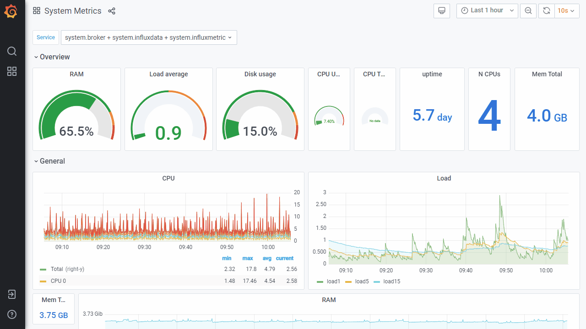
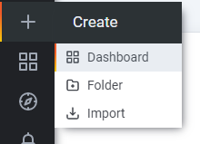
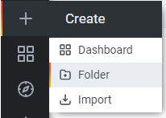
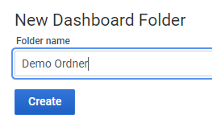
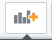
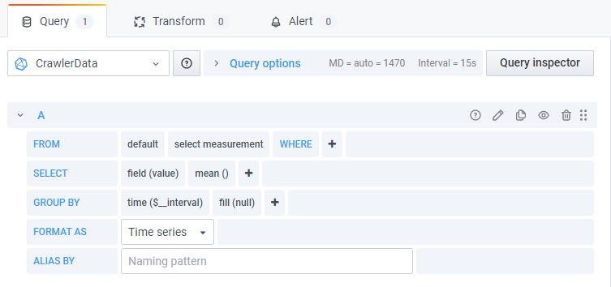
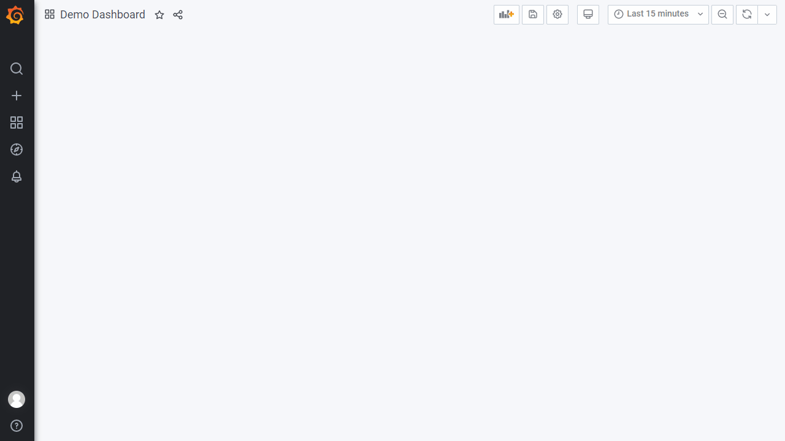
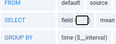

:::tip
 Valid from Edge (Crawler) version = **2.7.1**
:::

## General information about visualization (Grafana)

- The visualization platform "Grafana" is used for visualizing measured values and other data.
- It offers a wide range of options for displaying data
- Depending on the data points and use case, various display options are available
- Multiple panels can be configured in a dashboard
- Each panel can include several measured variables and be configured individually.
- Tutorials and general tips & tricks for Grafana
  - [Grafana documentation | Grafana documentation ](https://grafana.com/docs/grafana/v7.4/)
  - [Tutorials | Grafana Labs](https://grafana.com/tutorials/)
  - [Tips for Designing Grafana Dashboards](https://www.percona.com/blog/designing-grafana-dashboards/)
  - …

:::note
ℹ The Edge (Crawler) uses Grafana version 7.4.
:::

---
## Viewer vs. Editor

No login is required to view previously configured dashboards. If you want to create new dashboards or panels, or edit existing ones, you must log in with an "Editor" account.

To log in, click the icon in the lower left area. You will then be prompted for a `username and password`.

## Creating dashboards

To create a new dashboard, click the "+" symbol in the left menu bar and select "Dashboard". A page with a blank panel will open.

You can now add content to the dashboard and configure advanced settings.

:::caution
For the dashboard to persist, it must first be **saved**. To do so, click the 💾 symbol in the upper right area.

In the dialog that opens, you can give the dashboard a name (can be changed later) and sort it into a folder. Then click "Save".
:::

### Creating folders

Folders are used to organize dashboards. You can create as many folders as you like and assign dashboards to them.

To create a folder, click the "+" symbol in the left menu and select "Folder" from the submenu.

Enter the desired name for the folder and confirm with "Create".

### Export/Import of dashboards

You can export dashboards and import them on another device or for restoration.

Open a dashboard that you want to **export**. Click the "Share" symbol in the upper left area (next to the title) and select the "Export" option. Use "Save to file" to download the dashboard (settings and panels) as a file.

To **import** an exported dashboard, first click the "+" symbol in the left menu and select "Import". In the following dialog you can select the dashboard file (file extension = .json). You can then change the name, folder, and UID of the dashboard. If a dashboard with the same name or UID already exists, the corresponding information must be adjusted. You can also overwrite the existing dashboard.

## Adding content to a dashboard

A dashboard consists mainly of so-called panels. These can be created and configured individually.

To create a new panel, click the "+" symbol in the upper right area (to the left of the save symbol).

A new panel is always inserted at the top and can then be placed individually within the dashboard. Select "+ Add new panel" in the added box. You will be directed to the editor page for a panel. This area allows configuration of the data source and the display.

### Selecting a measured variable

For data to be displayed in a panel, at least one measured variable must be selected. This is done in the lower area, below the display preview.

1. **Select Measurement***:* Select source here. If this is not available for selection, no values have been recorded yet for configured measured variables. If you still want to set up the visualization, you can also enter source manually (note lowercase spelling).

2. **Select field device**: Click the "+" symbol to the right of "WHERE" and select "device\_name". Then click "select tag value" and choose the desired device.

3. **Select folder**: To select a measured variable, you must first select the folder in which the measured variable was created (see How-To: Adding measured variables, How-To: Editing configured measured variables). To do this, click the "+" symbol again and select "group\_\*". Then click "select tag value" and choose the desired folder. Repeat these steps until you have reached the target folder.

4. **Select measured variable**: Click the "+" symbol again and select "variable". Select the desired measured variable from the list. You can filter the selection by entering text.

Provided that values have already been recorded for the selected measured variable in the current time range, they should be shown in the preview area.

:::caution
If the selection of the measured variable has not yet been completed (e.g. only the device has been selected), values will already be displayed in the preview. These are not correct and represent a combination of multiple measured variables. It is therefore crucial to have selected a measured variable ("variable") at the end.
:::

### Measured variables of type "String"

Measured variables that are stored in the Edge (Crawler) as a string `(e.g. S7_DWORD`, see *Specification: Protocols and Field Devices*) require a change to the "field" value. To do this, click on "value" in the "Select" area. Enter the text `"stringValue"` (⚠ note case sensitivity).

### Changing and adjusting the display type ("Visualization")

Grafana offers a variety of display options. These include charts (line, bar), individual values, gauges, or tables. Depending on the display type, different settings (axes, legend, colors, labels) can be configured. The official *documentation* and *tutorials* from Grafana are referenced here.

All settings can be made in the right-hand area.
