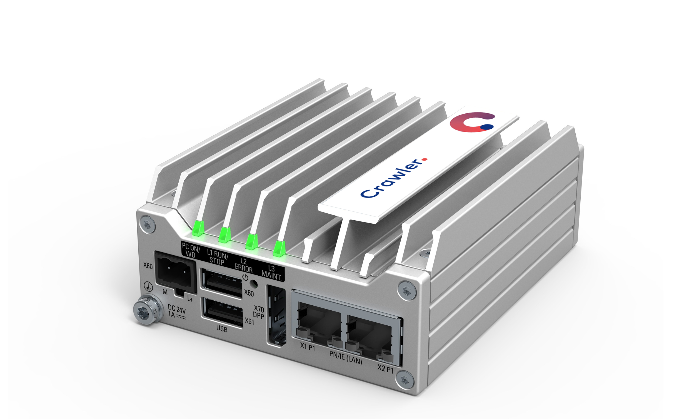

:::note
This page has not been translated yet. Content is shown in German.
:::

Der Crawler ist eine erweiterbare Edge Computing Plattform, die es auf faszinierende einfache Weise ermöglicht, alle relevanten Daten direkt an der Anlage zu erfassen, auszuwerten und weiterführend zur Verfügung zu stellen.

Erhalten Sie nicht nur schnell neue und tiefe Einblicke in die Arbeitsweise ihrer Anlagen und ihre Prozesse, sondern profitieren Sie von weiterführenden Funktionen wie der digitalen Dokumentation, Machine Learning und Cloud Konnektivität.

---
## Mehrwert schaffen. 

| Der Vorteil des Crawlers ist die Verschmelzung aus Steuerungstechnik, Gateway-Technologie, einem integrierten App-Konzept und einer leicht zu bedienenden Web-Nutzeroberfläche.                                                                                                                                                                                               |
| ----------------------------------------------------------------------------------------------------------------------------------------------------------------------------------------------------------------------------------------------------------------------------------------------------------------------------------------------------------------------------- |
| Durch seinen modulares, erweiterbares Konzept lassen sich kleine Anwendungsfälle, aber auch komplexe, die komplette Fertigung einbeziehende Digitalisierungs-Lösungen individuell und schnell umsetzen. Der Crawler ist damit ein idealer Wegbereiter und Startpunkt für die Digitalisierung Ihrer Fertigungsprozesse.                                                        |
| Der Crawler enthält bereits vorinstallierte, sofort nutzbare Funktionen, wie die Konnektivität zu SIEMENS Steuerungen und Modbus Geräten. Er erlaubt gleichzeitig die Erweiterung um weitere angepasste Funktionen wie spezifische Konnektoren, Condition-Monitoring oder Lastmanagement. Er ist anpassbar und erweiterbar für individuelle Anwendungen und Einsatzszenarien. |

---
## 

## Mit dem Crawler können Sie

| ### **Kosten senken durch:**                                                                                                                             |
| -------------------------------------------------------------------------------------------------------------------------------------------------------- |
| Erhöhung der Produktivität durch Vermeidung von Überlastungen, Planen von Stillständen, einer schnelleren Fehlerbehebung und zielgerichteten Alarmierung |
| Einsatz innovativer Arbeits- und Dokumentationsmethoden                                                                                                  |
| Validierung von Investitionen                                                                                                                            |
| Identifikation und Nachweis von Schwachstellen                                                                                                           |
| Kosteneffizientes Gesamtkonzept                                                                                                                          |

| ### **Anlagen und Prozesse optimieren durch:**                                               |
| -------------------------------------------------------------------------------------------- |
| Transparenz und einzigartige Anlagenkenntnis durch Datenaggregation, Historien, Auswertungen |
| Machine Learning                                                                             |
| Zur Verfügungstellung relevanter Informationen (intern und extern)                           |
| Einfache Bedienkonzepte, «Plug & Play»                                                       |
| Anbindung & Integration mobiler Endgeräte                                                    |
