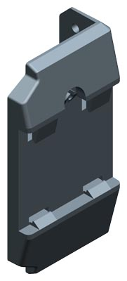
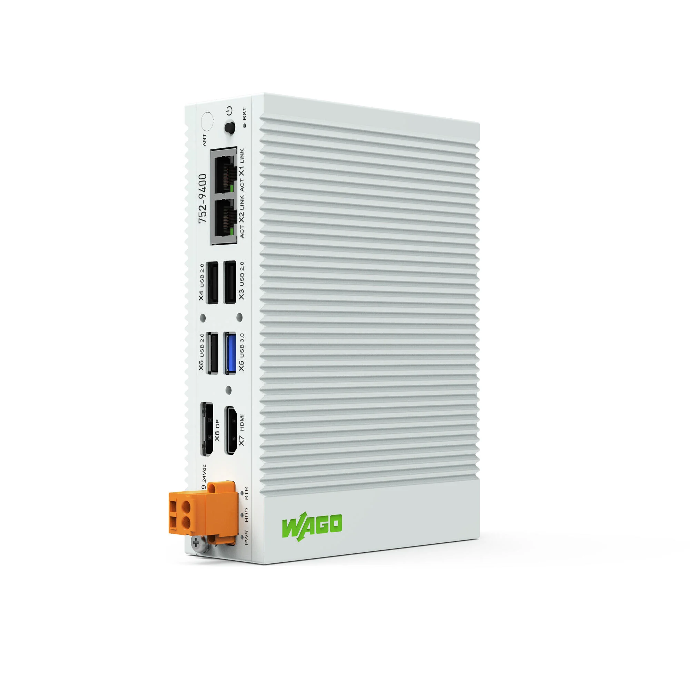

# Platform Variants

## Hardware

### Siemens SIMATIC IPC127E

- Intel® Atom E3940 Quadcore 1.80 GHz
- 4GB RAM
- 64GB FLASH
- 2 x ETHERNET 
- 2x USB 3.0
- Display Port

**Form factor**

| **Width** | 40 mm / 1.575 inches  |
| --------- | --------------------- |
| **Height** | 150 mm / 5.906 inches |
| **Depth**  | 105 mm / 4.134 inches |

### Mounting

DIN rail: DIN bracket:

DIN rail: Book mounting:

---
### WAGO Edge Computer **752-9400**

- Intel® Atom E3845 Quadcore 1.91 GHz
- 4GB RAM
- 64GB FLASH
- 2 x ETHERNET 
- 4 x USB (including 1x USB 3.0)
- HDMI and Display Port

**Form factor**

| **Width** | 40 mm / 1.575 inches  |
| --------- | --------------------- |
| **Height** | 150 mm / 5.906 inches |
| **Depth**  | 105 mm / 4.134 inches |

:::note
ℹ Mounting is a fixed part of the hardware; book mounting.
:::

## Virtual Machine

:::note
📄 Currently only **VMWare** is supported.
:::

### System requirements

- CPU: 4 cores, 1.8 GHz
- 4GB RAM
- 64GB disk space
